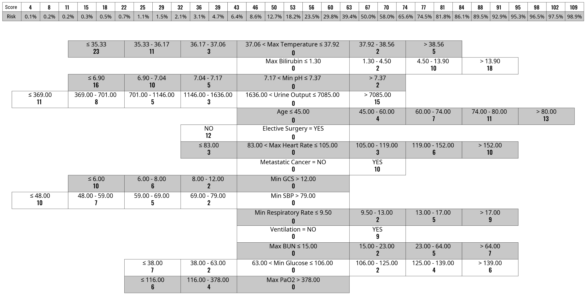

# Fast and Interpretable Mortality Risk Scores for Critical Care Patients

<figure>
    
</figure>

This repository contains the code implementation for experiments in the paper: *Fast and Interpretable Mortality Risk Scores for Critical Care Patients*. We detail the specific steps to reproduce our results below.

## Setup
* Install packages using `requirements.txt`.
* Set `PYTHONPATH` to `src/common`. This is because most of the scripts use modules in `mimic_pipeline` directory.

## Data
### Data Source
* MIMIC III: https://physionet.org/content/mimiciii/1.4/.
* eICU: https://physionet.org/content/eicu-crd/2.0/.

### Data Preprocessing for MIMIC III
1. Follow the official tutorial for MIMIC III to build a local postgres database (https://mimic.mit.edu/docs/gettingstarted/local/install-mimic-locally-ubuntu/).
2. Create concepts for MIMIC III using the code in official repository (https://github.com/MIT-LCP/mimic-code/tree/main/mimic-iii/concepts_postgres).
3. Run `src/common/sql/mimic3/extract/union_features.sql` and `src/common/sql/mimic3/extract/union_features_prep.sql`. This step preprocesses the features considered in our study, selects our study cohorts, and generates a tabular data for the patients.
4. Use `src/exp_6.6_to_6.27/union_train_test.ipynb` to generate train and test splits for MIMIC III study cohort.

### Data Preprocessing for eICU
1. Similarly as MIMIC III, build a local postgres database (https://eicu-crd.mit.edu/tutorials/install_eicu_locally/). Then, create concepts for eICU using code in officla repository (https://github.com/MIT-LCP/eicu-code/tree/main/concepts).
2. Run `src/common/sql/eicu/extract/union_features.sql`, this script selects the cohorts for our study and generates the data in a tabular form.
3. Use `src/exp_6.6_to_6.27/union_eicu_generate.ipynb` to save the data as a `.csv` file locally.

## Results

### Figure 1
1. Use `src/exp_6.6_to_6.27/mimic_groupfasterrisk_train.py` to train GFR models. Set group sparsity as 15. This creates the models without monotonicity constraints.
2. To generate risk scores with monotonicity constraints, run `src/exp_6.6_to_6.27/card_generation.ipynb`.

### Figure 3b
1. Use `src/exp_6.6_to_6.27/mimic_cross_validation.py` to perform nested cross valiadtion on MIMIC III. Please note that the hyperparameters in that file are tuned individually on each of the five folds on MIMIC III. If you would like to reproduce our results for hyperparameter optimization, perform the following steps: (1) run `src/exp_6.6_to_6.27/mimic_kfold_generation.ipynb` to generate 5 folds for MIMIC III; (2) use `src/exp_6.6_to_6.27/sweep.py` and `src/exp_6.6_to_6.27/sweep_oasis.py` to perform hyperparameter optimization. The possible hyperparameter combinations are stored at `params` directory.
2. Run `src/exp_6.6_to_6.27/mimic_baselines.ipynb` to obtain results for OASIS and SAPS II on MIMIC III.
3. Run `src/exp_6.6_to_6.27/OOD.ipynb` to obtain results for OASIS, SAPS II, and APACHE IV/IVa on eICU.

### Figure 3a
1. Run `src/exp_6.6_to_6.27/OOD_visualize.ipynb` to visualize the ROC and PR curves on eICU.

### Figure 4a
1. Use `src/exp_6.6_to_6.27/mimic_cross_validation.py`, train GroupFasterRisk models with group sparsity of 10, 15, 20, 25, 30, 35, 40, and 45.
2. After training is complete, run the **Group Sparsity** cell in `src/exp_6.6_to_6.27/visualize.ipynb`.

### Figure 4b
1. Run `src/exp_6.6_to_6.27/time_fasterrisk.py` to obtain an estimate of runtime for training GroupFasterRisk models.
2. Plot the figure using **Time Consumption** cell in `src/exp_6.6_to_6.27/visualize.ipynb`.

### Figure 5a
1. Obtain tabular data for each disease-specific cohorts using `src/exp_6.6_to_6.27/union_disease_generate.ipynb`. Then, generate the folds for MIMIC III subpopulations using `src/exp_6.6_to_6.27/mimic_kfold_disease_generation.ipynb`.
2. Train GroupFasterRisk models on MIMIC III subpopulation using `src/exp_6.6_to_6.27/mimic_cross_validation_disease.py`.
3. Plot the results using **Disease Specific** cell in `src/exp_6.6_to_6.27/visualize.ipynb`.

### Figure 5b
1. Run `src/exp_6.6_to_6.27/OOD_disease.ipynb` to obtain the results.

### Figure 6
1. Use `src/exp_6.6_to_6.27/mimic_feature_selection.py` to train ML models. Train one set of models with GroupFasterRisk features, and train another set of models with OASIS features.
2. Run **Feature Selection** cell in `src/exp_6.6_to_6.27/visualize.ipynb`.

### Figure 7
1. Use `src/exp_6.6_to_6.27/mimic_cross_validation.py` to train GFR-14, GFR-OASIS, and GFR-40. These models are for internal evaluation (MIMIC III).
2. Use `src/exp_6.6_to_6.27/mimic_cross_validation.py` to train ML models. Train one set of models with OASIS features, and train another set of models with all 49 features. These models are for internal evaluation (MIMIC III).
3. Use `src/exp_6.6_to_6.27/mimic_groupfasterrisk_train.py` to train GFR-14, GFR-OASIS, and GFR-40 for out-of-distribution evaluation (eICU).
4. Use `src/exp_6.6_to_6.27/mimic_ml_train.py` to train ML models. Similarly, train one set of models with OASIS features, and train another set of models with all 49 features. These models are for out-of-distribution evaluation (eICU).
5. The results for AutoScore on both MIMIC III and eICU can be obtained with `src/exp_6.6_to_6.27/autoscore.r`.
5. Use **Complexity Graph** cell in `src/exp_6.6_to_6.27/visualize.ipynb` to generate the figures.

### Table 1
1. Use `src/exp_6.6_to_6.27/OOD_calibrate.ipynb` to calibrate GFR models on eICU dataset using a subset of 2000 patients.
2. Use `src/exp_6.6_to_6.27/OOD_fairness.ipynb` to obtain the numerical results in Table 1.
